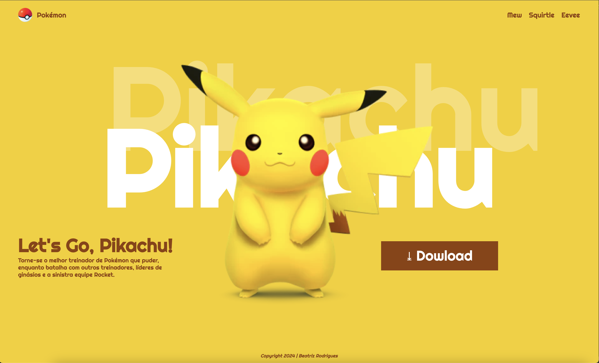

# landing page - Let's Go, Pikachu

__
## Sobre
Site do tipo lading page para divulgar o jogo Let's, Go Pikachu.
O intuito deste projeto é colocar em prática o conhecimento adquirido sobre
as linguagens de marçacão, HTML, CSS e MarkDdown, no curso de Desenvolvimento de Sistema do [SENAI JANDIRA](https://sp.senai.br/unidade/jandira/)

__
##Tecnologias utilizadas
- HTML
- CSS
- Markdown
- Git

__
# Autor 
- [Beatriz Rodrigues](www.linkedin.com/in/bia-rodrigues-5949a8294)# 05--pikachu
